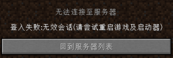

# 常见问题

这里总结了使用时经常出现的问题

```mdx-code-block
import DocCardList from '@theme/DocCardList';
import {useCurrentSidebarCategory} from '@docusaurus/theme-common';

<DocCardList items={useCurrentSidebarCategory().items}/>
```

---

## 我的世界端口多少？
> JAVA版默认端口25565   
> PE/BE/基岩版默认端口19132

## 映射可以用在什么环境下？
> 基于TCP、UDP协议以及Windows环境下

## 啥时候更新Linux版本
> 目前已有计划，尽情期待

## 5元能用多久？
> 两个朋友联机可以用近20天 至于准确用多久,因人而异

## 提示发送验证码失败怎么办？
> 重试即可

## 提示NatGo 客户端 已停止工作 怎么办？
> 可以参考[【此链接】](./data_execution_prevention)

## 我的世界提示登录失败：无效的会话怎么办？
> 因为服务端那边开启了正版验证、或者是联机时用户未使用正版用户登陆游戏，解决方法:1、服务端关闭正版验证功能 2、如果是联机、请确保联机的用户是正版用户或使用了外置登录功能 也可以安装相关联机mod关闭验证功能



## 怎么氪金？ 可以联系客服或通过淘宝链接购买 
> 可以联系客服[【客服小超】](http://wpa.qq.com/msgrd?v=3&uin=672183160&site=qq&menu=yes)[【客服小伟】](http://wpa.qq.com/msgrd?v=3&uin=1666633881&site=qq&menu=yes) 或者通过淘宝连接[【淘宝店铺】](https://item.taobao.com/item.htm?spm=a1z10.1-c.w4004-22409864018.2.67477092FAdx3v&id=611262672455)


## 我应该选那个节点更好? 
> 根据您的地理位置决定 刷新节点后选择延迟最低的节点

## Minecraft显示服务器版本已过期
> 服务器刚开会这样,等一会就好了

:::tip
其他问题可以加入Q群提问,解决的问题会被更新到这里 Q群:1019593660 客服:[【客服小超】](http://wpa.qq.com/msgrd?v=3&uin=672183160&site=qq&menu=yes)[【客服小伟】](http://wpa.qq.com/msgrd?v=3&uin=1666633881&site=qq&menu=yes)
:::
