# 正常关闭数据执行保护

## 右击计算机，选择属性

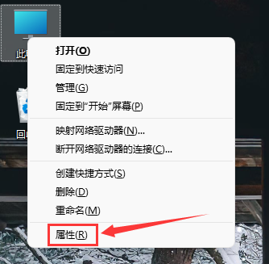

## 选择高级系统设置

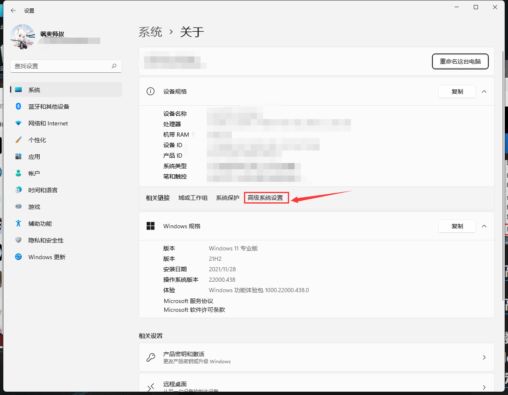

## 点击高级，选择设置

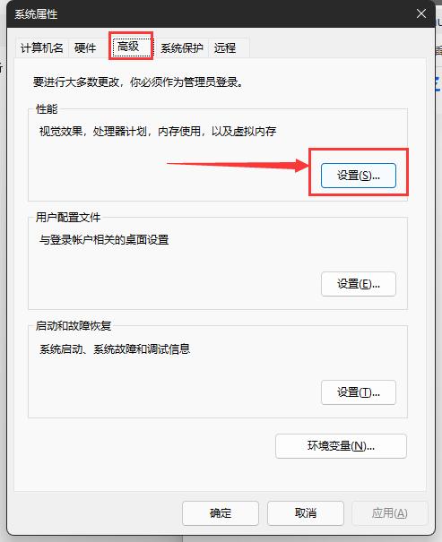

## 选择数据执行保护，然后在下面仅为基本windows程序和服务启用DEP前面点亮，然后点击确定

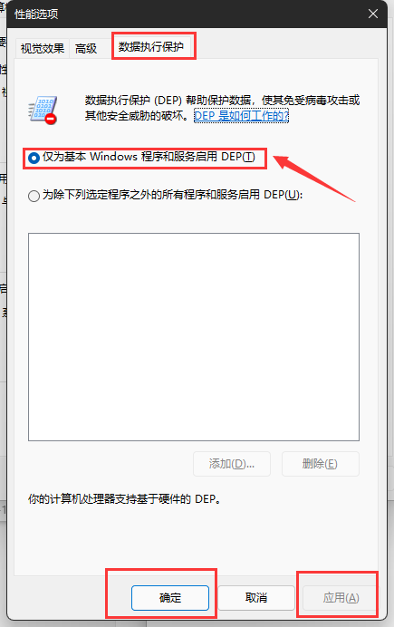

# 数据执行保护呈灰色时关闭

:::caution
默认的管理员账号是关闭开不了的
需要创建一个新的管理员账户才能关闭
:::

## 创建一个新管理员账户

### 进入控制面板

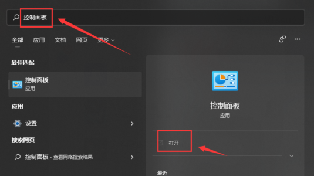

### 在大图标下进入用户账户

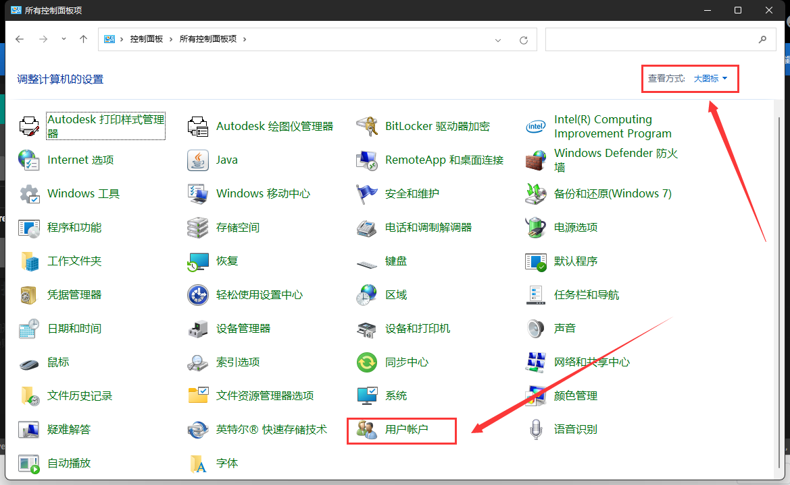

### 在电脑设置中添加新用户

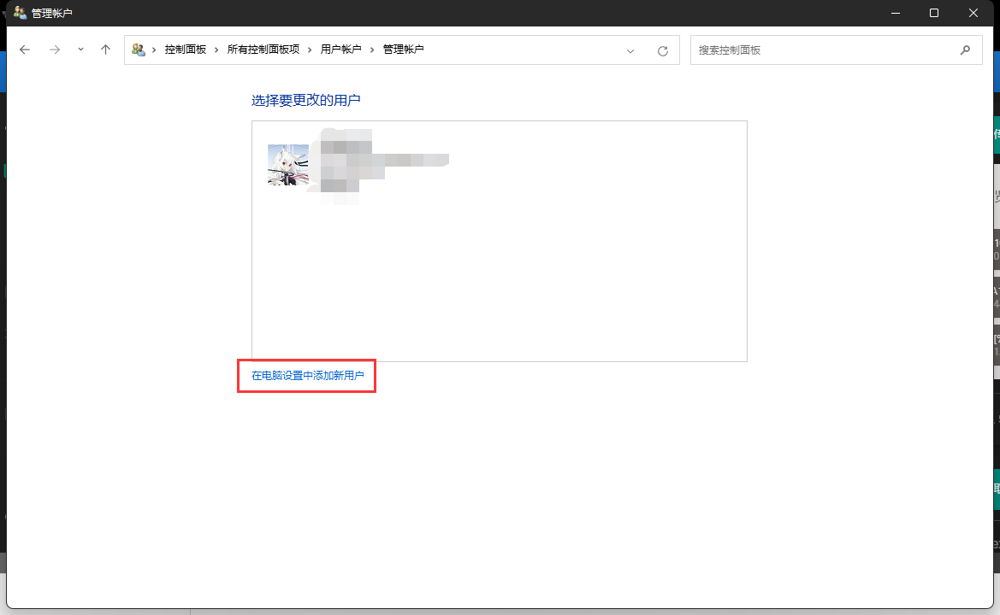

### 管理其他账户

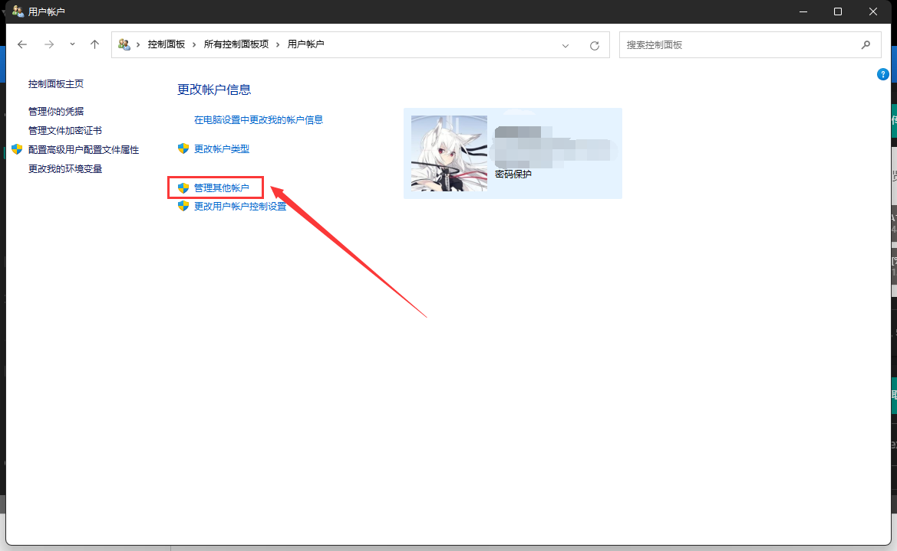

### 添加账户

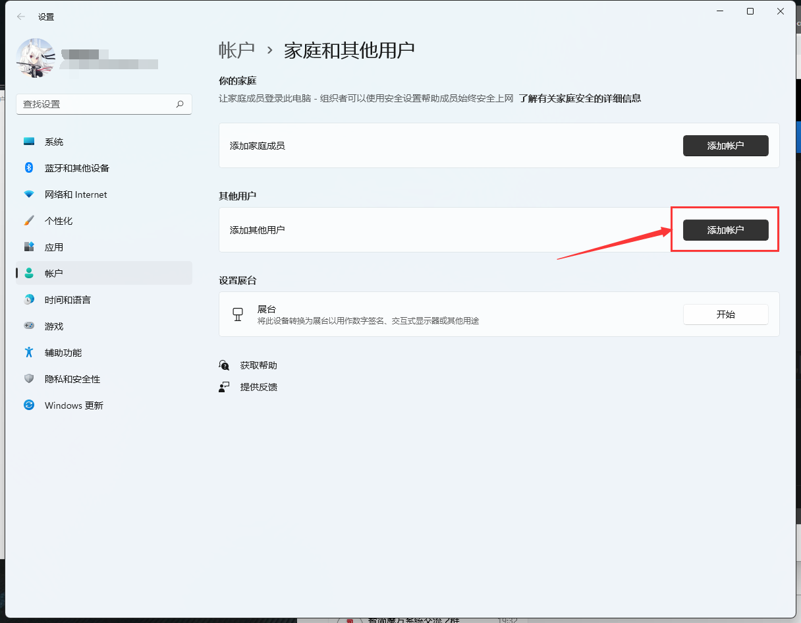

### 输入你要创建的这个账户的一些信息

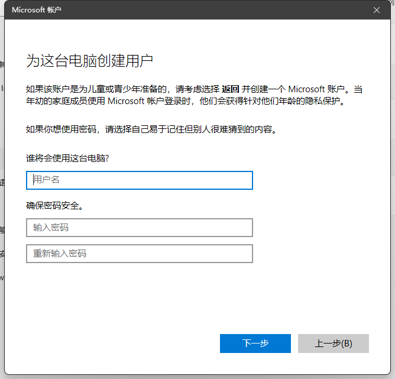

:::caution
记得要管理员权限
:::

## 登陆新创的账户

:::info
只要注销在登录的时候切换成新账户就行了（由于我的电脑不需要，所以没截图了）
:::

## 输入指令

### 在开始页输入cmd并以管理员身份运行

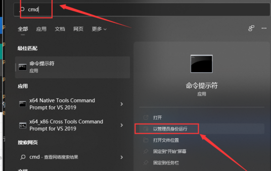

### 输入 `bcdedit /set nx optin alwaysoff` 并回车运行后重启

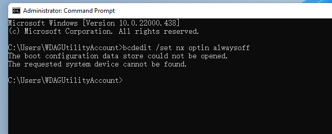

## 再切换回你之前的账户

你就看到你成功啦，你会发现，DEP也被开启了