# 《饥荒联机版》联机教程

## 如何获取映射端口

1.在游戏中找到存档，点击右边的管理世界

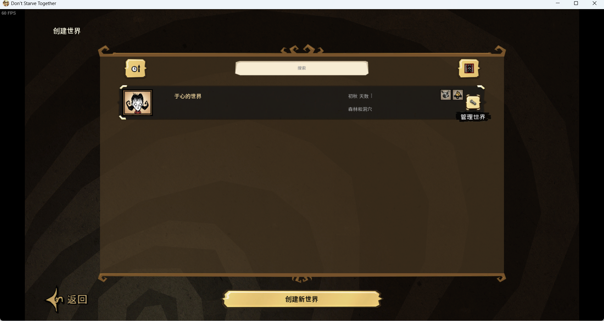

2.打开世界文件夹

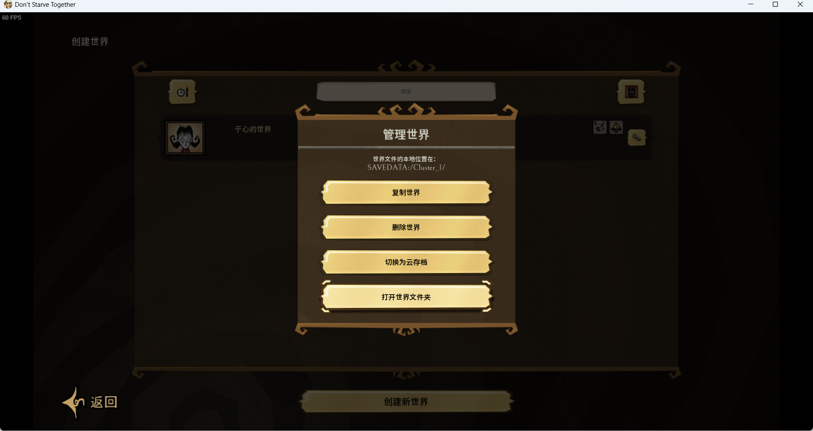

:::info
这边需要区分一下 **本地存档** 和 **云存档**
:::

### 本地存档

1.打开名为 **Master** 的文件夹

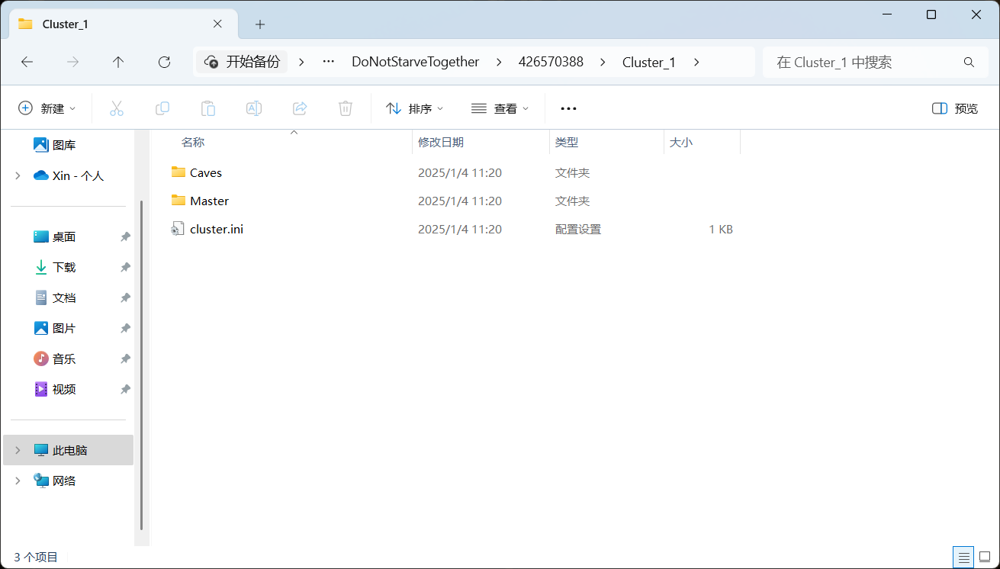

2.找到名为 **server.ini** 配置文件并打开

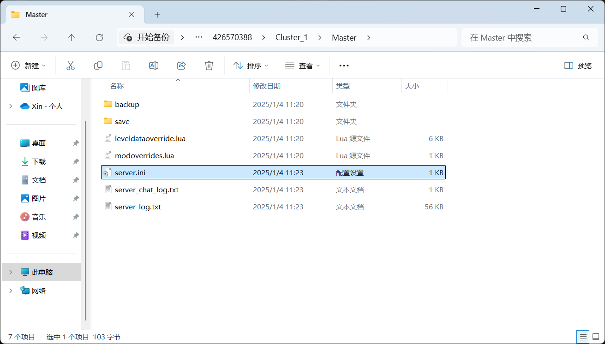

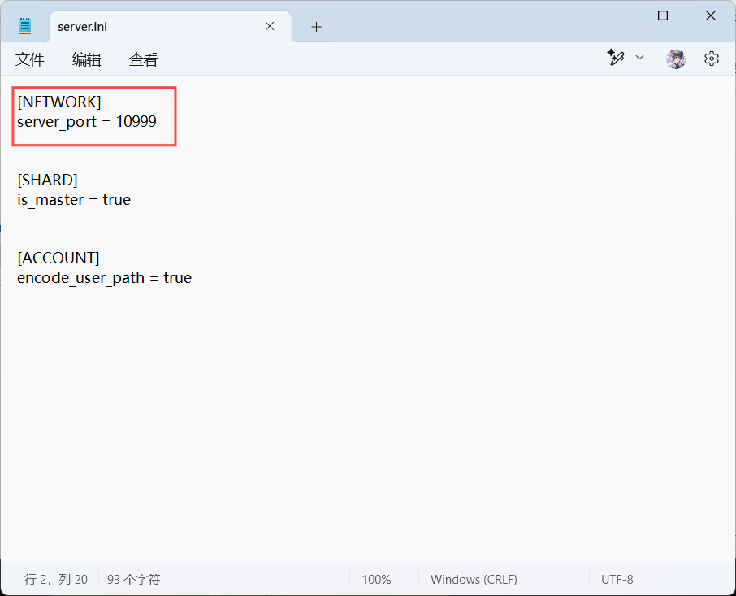

3.其中"server_port ="后面的就是端口，我这边为 **10999**

```
server_port = 10999
```

### 云存档

1.打开名为 **Master.zip** 的压缩包


2.找到名为 **server.ini** 配置文件并打开

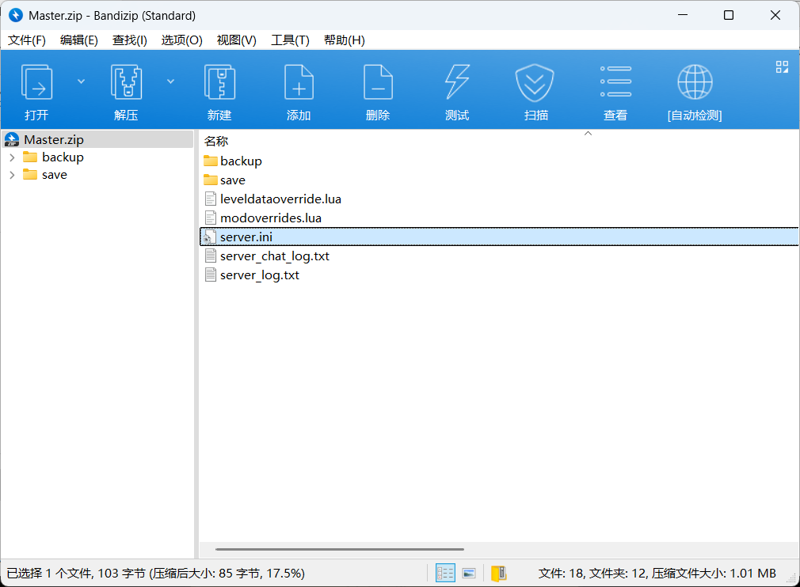


3.其中"server_port ="后面的就是端口，我这边为 **10999**

```
server_port = 10999
```

## 如何使用NatGo映射

1. 打开 NatGo 软件进入「映射管理」去「设置」映射信息
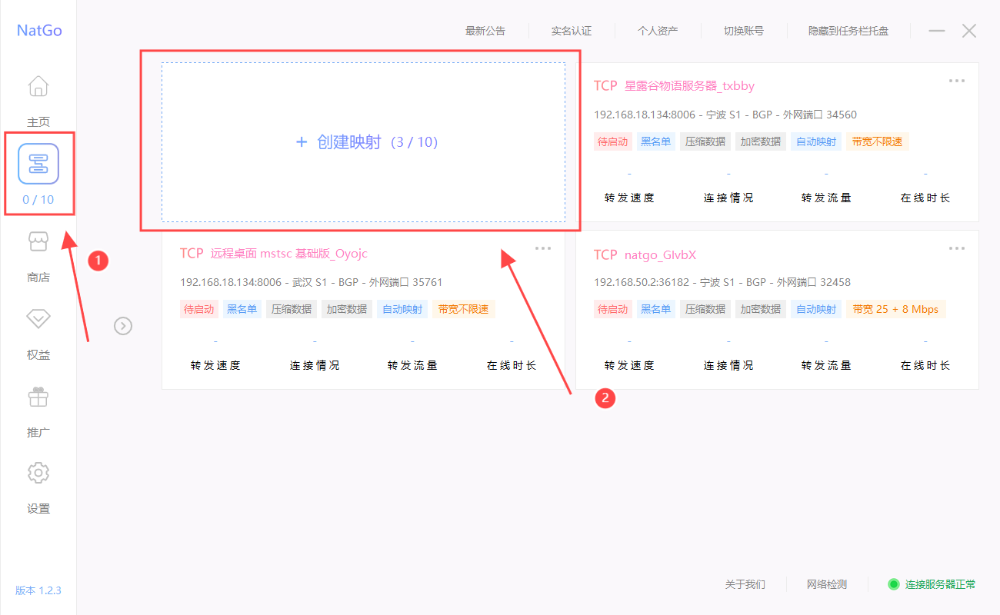

2. 设置映射信息

- 映射协议需要选择「UDP」，因为饥荒的端口是UDP协议
- 映射名称可以随便填，但要注意不可重复
- 内网IP一般默认即可，推荐「127.0.0.1」
- 内网端口根据游戏的不同设置不同的端口
  - 饥荒一般默认为10999，但如果不是请根据上文输入相应端口
- 映射节点推荐设置延迟最低的节点
  - 也可以自己选一个节点来照顾不同地区的用户
  - 如果出现节点未显示的情况可以「重新获取节点」将节点刷新出来
- 最后保存就大功告成了，保存之后自动启动

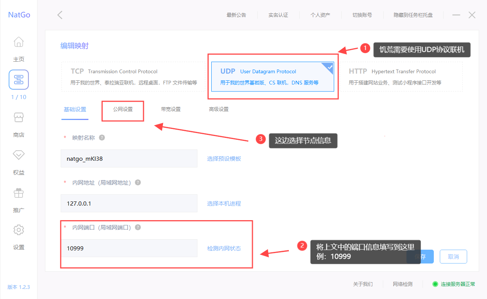

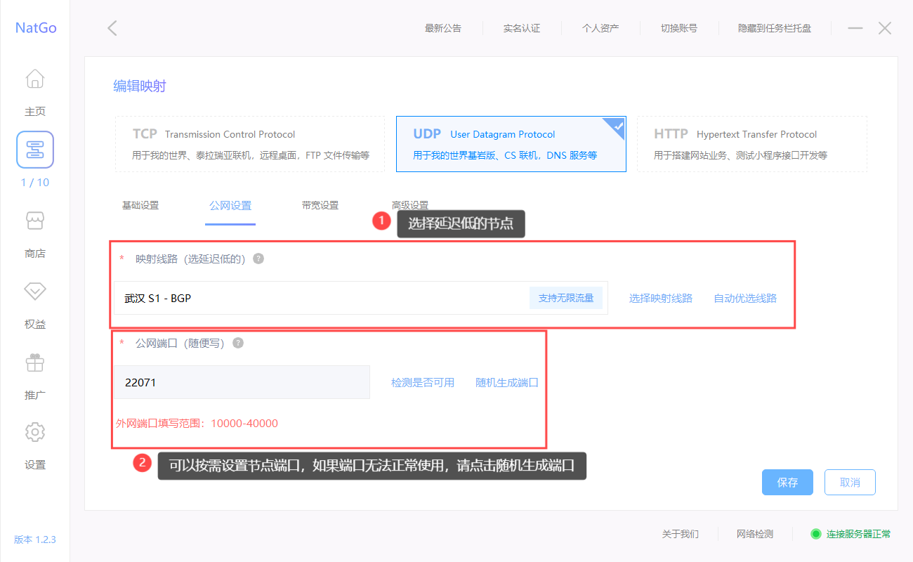

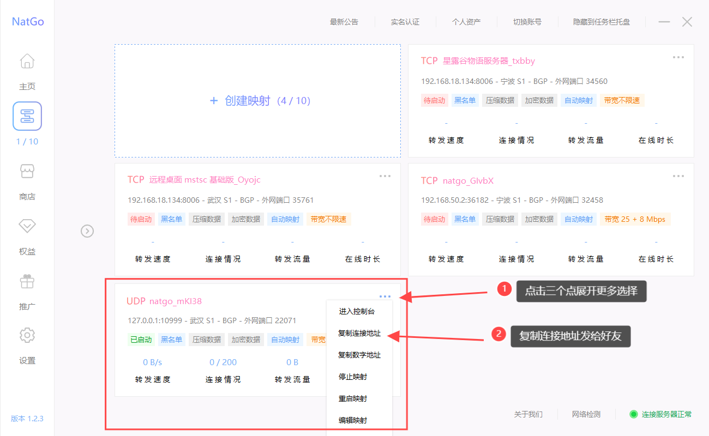

## 如何加入联机

1. 打开饥荒游戏，点击键盘上的 **~** 键(在TAB键和ESC键之间)会弹出控制台，在控制台中输入下面代码，回车即可加入游戏

:::tip
举个例子：如果你复制的链接长这样 `wh.s1.natgo.cn:22071` 可以拆成两部分，域名地址：`wh.s1.natgo.cn`，端口：`22071`
:::

```
c_connect("域名地址/数字地址",端口)
```

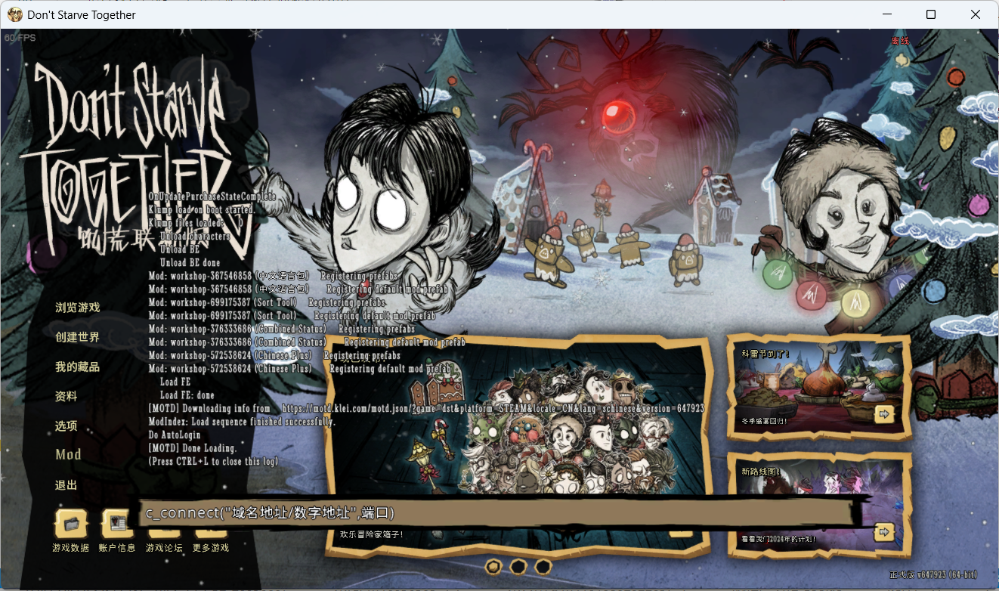